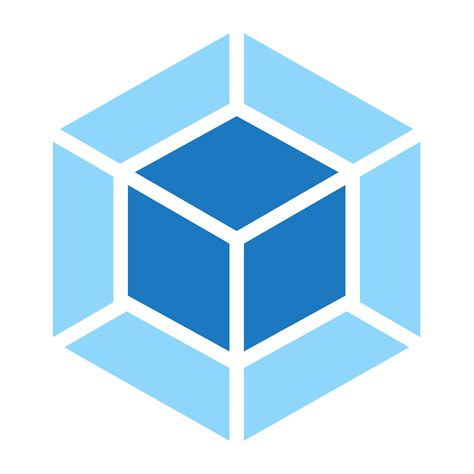

<h1 align="center">Hi 👋, I'm Roy Lopez</h1>
<h3 align="center">A passionate frontend developer from Argentina</h3>

- 🔭 **I’m a freelance front end developer**

- 👨‍💻 All of my projects are available at [**www.roylopez.dev**](https://www.roylopez.dev/)

- 📫 How to reach me **roylopezdev@gmail.com**

- 📄 Know about my experiences [Resume](https://drive.google.com/file/d/1vZW-yuxCYOLGuGtKfrYpBV1DAWsVIwI1/view?usp=sharing)

<h3 align="left">Languages and Tools:</h3>
  

    <!-- HTML -->
    <picture>
    
    </picture>
    <!-- CSS -->
    <picture></picture>
    <!-- Javascript -->
    <picture></picture>
    <!-- React -->
    <picture></picture>
    <!-- Node.js -->
    <picture> </picture>
    <!-- Git -->
    <picture></picture>
    <!-- Webpack -->
    <picture></picture>
    <!-- Babel -->
    <picture> </picture>
    <!-- Next.js -->
    <picture>   </picture>
    <!-- Photoshop -->
    <picture></picture>
    <!-- Tailwind -->
    <picture> </picture>
   

<h3 align="left">Connect with me:</h3>

<h3 align="left">Codewars Geek</h3>
<!-- Codewars -->

  <picture>
    
  </picture>

<!-- Most used languajes -->

  <picture>
    
  </picture>

<!-- Stats -->

&nbsp;<picture></picture>
